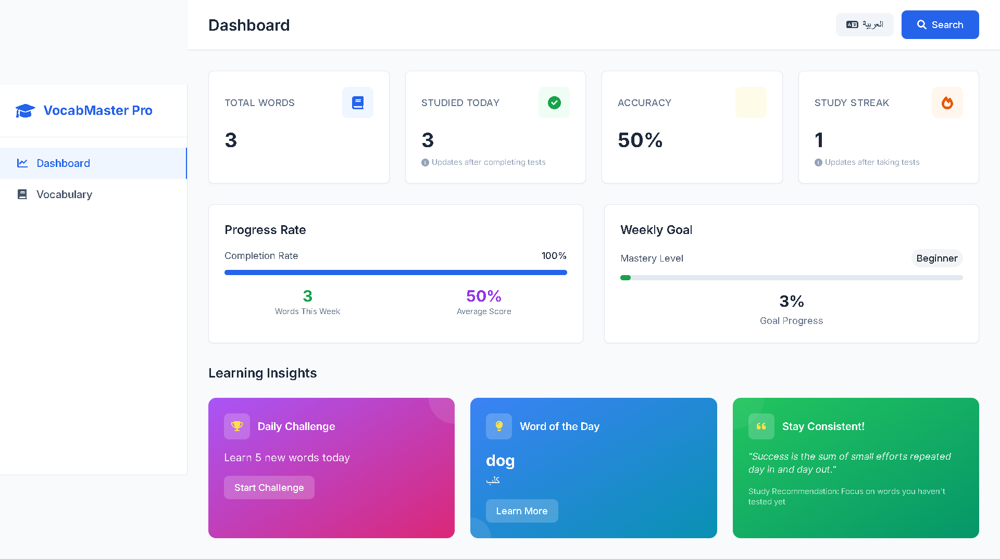
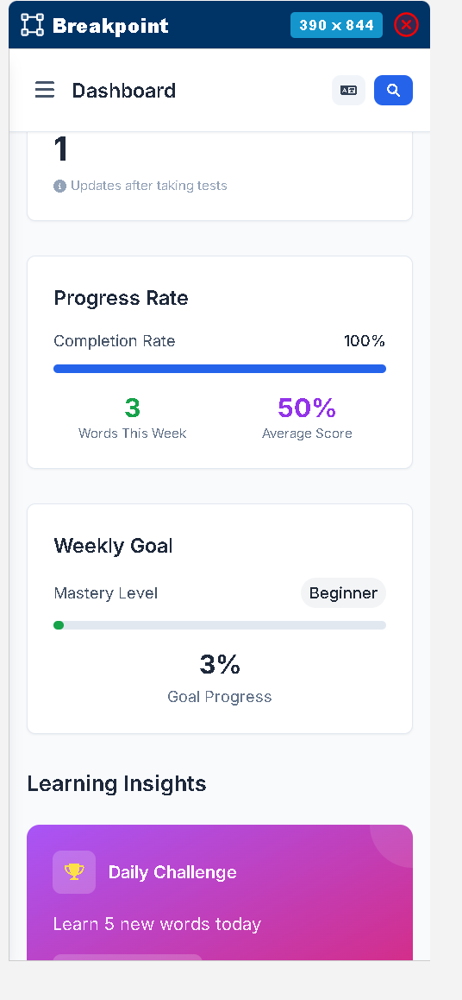

# 🎓 VocabMaster Pro

### _Professional English Vocabulary Learning Platform_

_Transform your English vocabulary learning journey with our intelligent, bilingual platform designed specifically for Arabic speakers._

---

## 🖼️ **Application Preview**

### 📊 **Dashboard Overview**

_Real-time analytics and personalized learning insights_

### 🧠 **Interactive Learning Experience**

_Adaptive quiz system with multiple difficulty levels_

### 📱 **Mobile-First Design**

_Seamless experience across all devices_

---

## ✨ **Core Features**

<table>
<tr>
<td width="50%">

### 🎯 **Smart Learning System**

- 🧠 **AI-Powered Recommendations**
- 📊 **Adaptive Difficulty Scaling**
- 🎮 **Gamified Learning Experience**
- 📈 **Real-time Progress Analytics**
- 🏆 **Achievement System**

</td>
<td width="50%">

### 🌟 **Professional Tools**

- 📚 **Advanced Vocabulary Management**
- 🔍 **Instant Search & Filtering**
- 📱 **Cross-Platform Synchronization**
- 💾 **Data Export/Import**
- 🎨 **Customizable Interface**

</td>
</tr>
</table>

### 🚀 **Quiz Modes & Learning Paths**

| Mode   | Description          | Difficulty           |
| ------ | -------------------- | -------------------- |
| 🇬🇧➡️🇸🇦 | English to Arabic    | Easy • Medium • Hard |
| 🇸🇦➡️🇬🇧 | Arabic to English    | Easy • Medium • Hard |
| 🔄     | Mixed Mode Challenge | Adaptive             |
| ⚡     | Speed Learning       | Time-based           |

---

## 🛠️ **Technology Stack**

---

## 🌟 **Why Choose VocabMaster Pro?**

|      🎯 **Feature**       |               🌟 **Benefit**               |
| :-----------------------: | :----------------------------------------: |
| 🧠 **Smart AI Learning**  |  Personalized vocabulary recommendations   |
| 📊 **Advanced Analytics** | Track your progress with detailed insights |
|    🎮 **Gamification**    |       Make learning fun and engaging       |
|    📱 **Mobile-First**    |          Learn anywhere, anytime           |
|   🔄 **Real-time Sync**   |     Seamless experience across devices     |
|    🎨 **Modern UI/UX**    |       Beautiful, intuitive interface       |

---

## 🎯 **Perfect For**

🇸🇦 **Arabic Speakers** • 🎓 **Students** • 💼 **Professionals** • 🌍 **Language Enthusiasts**

_Transform your English vocabulary learning journey today!_

### 🚀 **[Start Learning Now →](https://vocab-master-pro-six.vercel.app/)**

---

_Made with ❤️ for the global learning community_

